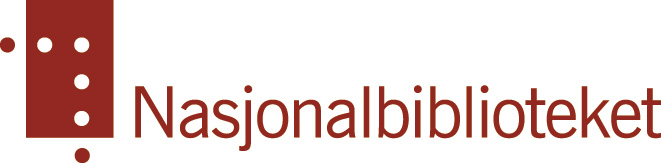
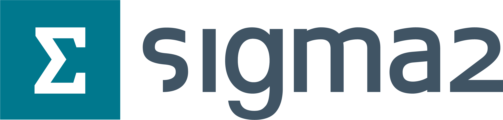
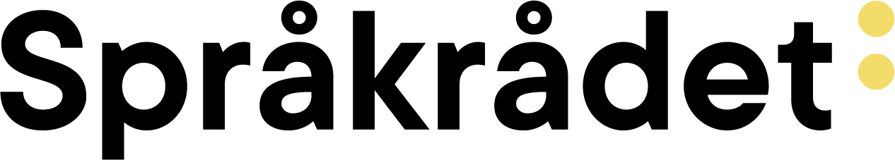

  
  &nbsp;&nbsp;
  
  &nbsp;&nbsp;
  

  
  &nbsp;&nbsp;
  

  Nasjonal statusmelding: 
  Forskning og utvikling for store, åpne språkmodeller i Norge

>

<strong>(Utkast av 5. juni 2026)</strong>

## **Bakgrunn**

Store språkmodeller (*Large Language Models*, LLM-er) er bærebjelken i dagens generative kunstige intelligens (KI), og de er i ferd med å bli samfunnskritisk infrastruktur på linje med strøm og kommunikasjonsnett. Norske forskningsmiljøer går nå sammen i *Språkmodellklynge Norge* for å samle kreftene på feltet. Klyngen samler LLM-fagmiljøene ved Nasjonalbiblioteket (NB), Norges teknisk-naturvitenskapelige universitet (NTNU) og Universitetet i Oslo (UiO), med Sigma2 og Språkrådet som faste observatører. Partene legger opp til tett samarbeid med nordiske og europeiske fagmiljøer.

Dette dokumentet gir en overordnet strategisk vurdering av forskningen på og utviklingen av store språkmodeller i Norge og beskriver nødvendige koordineringstiltak for satsing på dette feltet. Det supplerer Agenda Kaupangs kartlegging *Fra ord til økosystem: Språkmodeller og generativ KI i Norge* (2025), bestilt av Digitaliserings- og forvaltningsdepartementet. Agenda Kaupang-rapporten kartlegger anvendelses- og leverandørsiden av økosystemet grundig, men berører i liten grad det forsknings- og kunnskapsgrunnlaget norske språkmodeller hviler på.

## **Hvorfor egne norske språkmodeller?**

LLM-er er store nevrale nettverk, trent på enorme datamengder. De gjør datasystemer i stand til både å «forstå» menneskelig språk og å «ytre seg» om komplekse saksforhold.

Bak en velfungerende språkmodell ligger en lang verdikjede: tilrettelegging og utvalg av treningsmateriale, arkitektur- og metodevalg for trening tilpasset språklige og kulturelle behov, systematisk evaluering av ytelse og adferd, finjustering til konkrete bruksområder, samspill med brukerpartnere, og effektiv utnyttelse av begrenset trenings- og evalueringsdata på kostbar regnekraft. 

Når LLM-er blir kritisk infrastruktur, handler eierskap til denne verdikjeden om mer enn teknologi: om digital suverenitet, samfunnssikkerhet, åpenhet og språklig og kulturell identitet. Norge risikerer dyp avhengighet av lukket teknologi og utenlandske leverandører – i praksis teknologiselskap i USA og Kina. Sikkerhetsaspektet er minst like alvorlig, siden KI-sikkerhet forutsetter dybdeinnsikt i alle ledd og muligheter for tilpasning og kontroll.

Ved første øyekast kan man få inntrykk av at de flerspråklige modellene fra de store teknologiselskapene fungerer bra for norsk. Det er imidlertid godt dokumentert hvordan dominansen av engelskspråklige (og oftest amerikanske) data i treningsmaterialet smitter over på det som genereres for språk med lavere grad av representasjon – både når det gjelder meningsinnhold og språklige vendinger. 

Den språkpolitiske dimensjonen er her sentral, og generativ KI virker allerede inn på språkutviklingen i Norge: KI-generert tekst ensretter ordvalg, syntaks og stil og bringer med seg anglisismer. Norskutviklede språkmodeller er en forutsetning for å ivareta norsk kulturarv og språkpolitiske mål – herunder vernet av nynorsk og samiske språk – og for at offentlig sektor skal kunne følge vedtatt språkpolitikk. Også bokmål er globalt sett et lite språk, og markedskreftene alene vil ikke ivareta norske språk og verdier.

Full åpenhet – om treningsdata, programvare, modellvekter og evalueringer – er forutsetningen for at norske språkmodeller skal være etterprøvbare, faglig så vel som i et nasjonalt sikkerhetsperspektiv. I et slikt økosystem må offentlige forskningsmiljøer inneha en sentral rolle.

## **Trenger Norge egen forsknings- og utviklingskapasitet?**

Avstanden fra grunnleggende forskning til anvendt teknologi er kort på LLM-feltet. I de største teknologiselskapene i USA og Kina foregår begge deler under samme tak, og store deler av kunnskapen om effektiv LLM-utvikling forblir bedriftsintern. Metodedetaljer, parametervalg og praksiser forblir innsidekunnskap som verken er publisert eller umiddelbart reproduserbar utenfor disse miljøene. Et land uten egen forskningskapasitet vil ikke bare være avhengig av utenlandske modeller, det vil mangle evnen til å forstå dem.

Mye av fremgangen man har sett for språkmodeller de siste årene skyldes *skalering* – av både data, modellstørrelse, og regnekraft. Men dette forutsetter store datamengder. Utvikling av gode modeller for språk som har mindre mengder data tilgjengelig krever derfor metodologiske nyvinninger, som for eksempel «*data-constrained*» arkitektur- og algoritmetilpasninger eller mekanismer for å ivareta Norges språklige normer og konvensjoner.

Parallelt må det gjøres et stort arbeid med å få på plass de nødvendige dataene for trening og evaluering, i form av innsamling, tilrettelegging, annotasjon, m.m. Dette gjelder spesielt den type spesialtilpassete data som kreves under såkalt *post-trening* – altså den fasen av trening hvor man styrer modellene mot hva som anses som trygt, sikkert, pålitelig, og passende. Her kreves både metoder og data som er relevante og representative for en norsk kontekst. Per i dag er det betydelige mangler på dette området.

I tillegg kommer særnorske behov ingen andre kan forventes å løse. Norske språknormer og dialektvariasjon i skrift og sjangerkonvensjoner lar seg vanskelig fange opp i standard LLM-arkitekturer. Samiske språk har enda mer begrensede mengder data og krever målrettet metodikk. Norge har samtidig et språklig, kulturelt og politisk fellesskap med Sverige og Danmark som er underutnyttet.

Grunnleggende forskning på språkmodeller er utilstrekkelig koordinert og finansiert. Som Agenda Kaupang-rapporten beskriver, er økosystemet for utvikling av norske språkmodeller dominert av et fåtall offentlige og akademiske aktører, og barrierene – fragmentering, kompetansemangel og uklare ansvarsforhold, kortsiktig finansiering, mangel på datasett, begrenset tungregnekapasitet – forsterker hverandre. Tildelingen av KI-milliarden i 2025 etablerte seks nye KI-forskningssentre, men ingen av dem har språkmodeller som kjernemandat. Resultatet er en reell fare for tørke i norsk LLM-forskning – nettopp i en periode der teknologiutviklingen går raskest og avhengigheten av utenlandske aktører er størst.

## **Forskningssamarbeid i Norden og Europa**

De tre største forskningsmiljøene på store språkmodeller i Norge – Nasjonalbiblioteket, NTNU og UiO – står sammen bak Språkmodellklynge Norge. UiOs og NTNUs deltakelse i større FoU-initiativer under *Horizon Europe*\- og *Digital Europe*\-programmene, som for eksempel HPLT, TrustLLM og OpenEuroLLM, gir forankring i en europeisk forskningskontekst. Men særnorske behov risikerer å drukne. I OpenEuroLLM behandles for eksempel bokmål og nynorsk under ett, og norske treningsdata på rundt 100 milliarder ord forventes å utgjøre under én prosent av det totale treningsmaterialet på 10–15 billioner ord. Dette kan være et godt utgangspunkt for generelle modeller, men ikke nok for modeller som skal speile norsk språk, kultur og samfunnsforhold med høy kvalitet.

På nordisk nivå er mulige synergier store og lite utnyttet. Nordiske, spesielt skandinaviske og samiske trenings- og evalueringsdata kan tilføre merverdi til nasjonal modellutvikling, og felles grunntrening kan gi kostnadsbesparelser. Kompetanseutveksling om dataeffektive metoder og effektiv bruk av de europeiske KI-fabrikkene er også viktig. Mindre, spesialiserte norske modeller kan gi både bedre ytelse og bedre kost-nytte enn store generalistmodeller for bruksområder i offentlig sektor, som for eksempel forvaltning, rettsvesen, utdanning og helse.

## **Hva mangler i dagens strategirunnlag?**

Norge har et omfattende politikkgrunnlag for KI gjennom blant annet *Nasjonal strategi for kunstig intelligens* (2020), *Langtidsplan for forskning og høyere utdanning 2023–2032* og *NOU 2024:14 Med lov skal data deles*. Regjeringen har satt mål om at offentlig sektor skal ta i bruk KI innen 2030, og varsler en nasjonal KI-infrastruktur med egenutviklede grunnmodeller og inferenstjenester. Nasjonalbiblioteket har fått i oppdrag å trene språkmodeller tuftet på norsk og samisk innhold.

Dette er gode og viktige rammer. En slik infrastruktur forutsetter et sterkt vitenskapelig kunnskapsgrunnlag. Det mangler i dag en samlet, forpliktende nasjonal satsing på forskningsfundamentet for språkmodellutvikling. Agenda Kaupang-rapporten kartlegger aktørbildet og foreslår tiltak rettet mot bruk, anskaffelser og koordinering, herunder en tydeligere rolle for KI Norge. Vurderingene av forskningsbehovene er imidlertid mindre utviklet, der grunnleggende metodeutvikling og evaluering av språkmodeller – metoder, testbatterier, sikkerhetsvurdering, språklig kvalitetskontroll – får liten plass.

Det er nettopp her uavhengige forskningsmiljøer er uerstattelige: Metode- og teknologiutviklingen foregår med høy fart. For å vedlikeholde et oppdatert kunnskapsgrunnlag for egenutviklede grunnmodeller i Norge må forskningsmiljøene kunne «henger med» i den globale utviklingen. Dette også for å kunne utdanne kandidater med spisskompetanse på området. Et økosystem som hovedsakelig finjusterer utenlandske modeller, vil ikke kunne vurdere kritisk hva disse modellene gjør, hvordan de feiler, eller hvor de ikke kan brukes forsvarlig. Statsbudsjettet for 2026 reflekterer foreløpig ikke de forsknings- og infrastrukturbehovene som følger av regjeringens egne KI-ambisjoner.

## **Anbefalinger**

Av hensyn til så vel digital som kulturell suverenitet må Norge etablere og drifte et helhetlig nasjonalt økosystem for utvikling, evaluering og anvendelse av egne, trygge og åpne språkmodeller. Det forutsetter blant annet styrket forskningskompetanse og \-kapasitet, storskala GPU-infrastruktur, tjenester for data- og modelldeling, samt rammer for samspill mellom grunnleggende forskning og praktisk anvendelse, inkludert styrket nordisk og europeisk samarbeid. Det kreves rask og koordinert handling på regjeringsnivå, inkludert samhandling med for eksempel Norges forskningsråd og Nordisk ministerråd. *Språkmodellklynge Norge* anbefaler å: 

1. **Igangsette en hurtigarbeidende prosess mot en helhetlig nasjonal LLM-strategi**, med reell involvering av de sentrale norske forskningsmiljøene sammen med øvrige nasjonale aktører.  
2. **Etablere et nasjonalt KI-forskningsenter for åpne språkmodeller** som samler aktørene i et faglig fellesskap, med en tilhørende **forskerskole**. I et femårsperspektiv bør det utdannes 15–20 doktorgrader.  
3. **Videreutvikle Sigma2** som nasjonal leverandør av regnekraft, LLM-tjenester og tungregningskompetanse, herunder **utvidet norsk engasjement i europeiske tungregningsinfrastrukturer** som LUMI-AIF og EuroHPC.  
4. **Stimulere til nordisk forsknings- og utviklingssamarbeid** gjennom blant annet data- og modelldeling, forskermobilitet, koordinert forskerutdanning, samt etablering av en **årlig nordisk møteplass for forskere og utviklere** av åpne språkmodeller.  
5. **Utvikle rettslige og praktiske rammer** for datadeling, som balanserer opphavsrett og personvern med behovene for trening på storskala data og for inspeksjon og validering av modeller.  
6. Etablere norsk medlemskap i det **europeiske *Alliance for Language Technologies*** (ALT-EDIC) og økonomiske rammer for deltakelse fra universitetsmiljøer i ***Digital Europe*****\-programmet**.

Norge har de språklige, faglige og institusjonelle forutsetningene for å bygge egenutviklede, åpne og etterprøvbare språkmodeller som speiler norsk språk, kultur og samfunn. Vinduet er smalt. En koordinert nasjonal satsning på LLM-forskning og \-infrastruktur vil legge det faglige fundamentet for et helhetlig økosystem og dermed bidra sentralt til digital suverenitet, samfunnssikkerhet og kulturell identitet.

